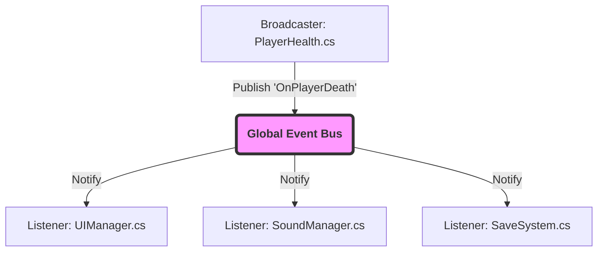

### How Data Flows

```mermaid
graph TD
    A[Broadcaster: PlayerHealth.cs] -->|Publish 'OnPlayerDeath'| B(<b>Global Event Bus</b>)
    B -->|Notify| C[Listener: UIManager.cs]
    B -->|Notify| D[Listener: SoundManager.cs]
    B -->|Notify| E[Listener: SaveSystem.cs]
    
    style B fill:#f9f,stroke:#333,stroke-width:4px
```
// Just broadcast the name—the script doesn't need to know the UI exists!
EventBus.Publish("LevelComplete");